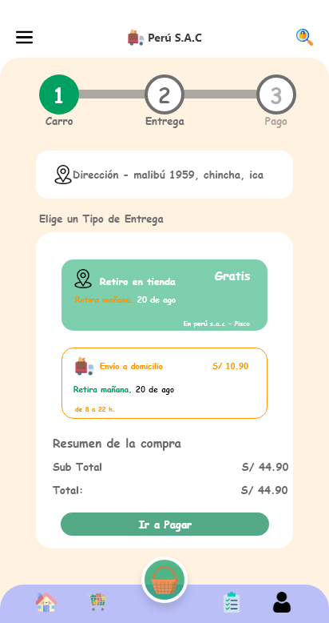

# Peru S.A.C

Interfaz movil de una app de abarrote

## App UI/UX en adobe xd

  <h5>VERSION 1.3.0</h5>
  <h3>parte de legeo, recuperar contraseña y crear cuenta</h3>
   
  
  
  
   
  

  <h3>parte crear cuenta y efecto loading</h3>
   
  
  

  <h3>parte de contenido de productos y vista</h3>
   
  
  
  
  
  
  
  

  <h3>parte de carrito de compras y pagos</h3>
   
  
  
  
  
  
  
  
  

 

<h3><b>Interfaz de Usuario desarrollada por:</b> Fabrizio Barrios Saavedra (RFBS23 - fabridev)</h3>

